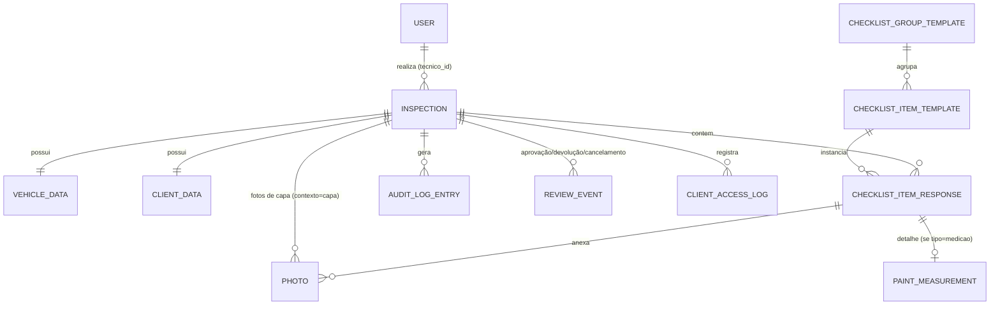

# Inspecta — Esquema de Banco de Dados v1.0

> PostgreSQL (Supabase). 12 tabelas em 5 domínios. Migrations completas com testes SQL em `docs/superpowers/plans/2026-07-09-inspecta-database-schema.md`. Derivado do modelo lógico em `docs/especificacao-tecnica-v1.md` §4. Duas colunas (`checklist_group_templates.ativo`, `checklist_item_templates.observacoes`) e as invariantes de `paint_measurements`/`checklist_item_responses` abaixo vieram depois, nas migrations `00011`–`00016`.

## Cortes ponytail aplicados

- `CERTIFICATE` fundido em `inspections` (era tabela própria pra uma relação 1:1).
- `PHOTO` + `REPORT_COVER_PHOTO` viraram uma tabela só, diferenciada por `contexto`.
- `classificacao` + `status` em `checklist_item_responses` — `status` virou coluna gerada a partir de `classificacao`, não um campo próprio (evita os dois divergirem).
- `audit_log_entries` sem valor anterior/novo — só quem, o quê, quando.

## Diagrama (ER)

## 01 · Núcleo

### `users`

| coluna | tipo | notas |
|---|---|---|
| id | uuid | **PK**, referencia `auth.users(id)` |
| nome | text | |
| email | text | unique |
| role | enum | `tecnico` \| `admin` |
| credencial_interna | text | |
| created_at | timestamptz | |

### `inspections`

| coluna | tipo | notas |
|---|---|---|
| id | uuid | **PK** |
| tecnico_id | uuid | **FK** → `users.id` |
| status | enum | `rascunho` \| `aguardando_aprovacao` \| `devolvida` \| `aprovada` \| `cancelada` |
| tipo_cliente | enum | `particular` \| `stand` |
| objetivo | enum | `compra` \| `venda` — check: stand exige `venda` |
| data_abertura | date | |
| data_finalizacao | timestamptz | |
| nota_geral | numeric(4,2) | |
| classificacao_final | enum | `A` \| `B` \| `C` |
| codigo_certificado | text | unique, gerado na aprovação |
| certificado_emitido_em | timestamptz | |
| created_at | timestamptz | |
| atrasada | boolean | gerado em runtime via view `inspections_with_flags`, não persistido |

### `vehicle_data`

| coluna | tipo | notas |
|---|---|---|
| inspection_id | uuid | **PK** + **FK** → `inspections.id` |
| matricula, marca, modelo, versao_trim | text | |
| ano_fabrico, ano_modelo | int | |
| cor, codigo_cor, vin, numero_motor | text | |
| numero_portas, potencia_cv | int | |
| combustivel, caixa_velocidades, tracao | text | |
| torque_nm | numeric(6,2) | |

### `client_data`

| coluna | tipo | notas |
|---|---|---|
| inspection_id | uuid | **PK** + **FK** → `inspections.id` |
| nome_solicitante | text | |
| tipo | enum | `particular` \| `stand` |
| contacto, email, responsavel_presente | text | |

## 02 · Templates do checklist

### `checklist_group_templates`

| coluna | tipo | notas |
|---|---|---|
| id | uuid | **PK** |
| ordem | int | unique |
| nome | text | |
| ativo | boolean | default `true`; grupo 12 (Motorização Especial, Fase 9) é `false` — importado mas não exposto no v1.0 |

### `checklist_item_templates`

| coluna | tipo | notas |
|---|---|---|
| id | uuid | **PK** |
| group_id | uuid | **FK** → `checklist_group_templates.id` |
| subcategoria, nome | text | |
| tipo | enum | `padrao` \| `medicao` |
| qtd_pontos_medicao | int | 3–5, obrigatório se `tipo=medicao` |
| aplica_stand | boolean | Particular sempre vê todos os itens; Stand só vê os itens com `aplica_stand = true` — hoje `false` em todas as linhas, pendente decisão dos sócios (RF-63) |
| observacoes | text, nullable | dicas do CSV-fonte sem coluna própria (thresholds, o que verificar) |

## 03 · Respostas & mídia

### `checklist_item_responses`

| coluna | tipo | notas |
|---|---|---|
| id | uuid | **PK** |
| inspection_id | uuid | **FK** → `inspections.id` |
| item_template_id | uuid | **FK** → `checklist_item_templates.id` |
| classificacao | enum, nullable | `otimo` \| `medio` \| `ruim` \| `NF` |
| observacao | text | |
| status | enum, **gerado** | `pendente` \| `respondido` \| `NF` — derivado de `classificacao` |
| atualizado_em | timestamptz | |
| — | — | unique(`inspection_id`, `item_template_id`) |
| — | — | constraint trigger deferrable: `classificacao='ruim'` exige ≥1 `photos` associada, checado no fim da transação |

### `paint_measurements`

| coluna | tipo | notas |
|---|---|---|
| item_response_id | uuid | **PK** + **FK** → `checklist_item_responses.id` |
| valores_um | numeric(6,2)[] | array nativo, sem tabela filha; trigger valida que o tamanho bate com `qtd_pontos_medicao` do item |
| resultado_calculado | enum, **gerado** | `OK` \| `anomalia` \| `reparacao_colisao` — coluna `GENERATED ALWAYS`, calculada pelo Postgres a partir de `valores_um` (faixas fixas no código); não gravável pelo app |

### `photos`

| coluna | tipo | notas |
|---|---|---|
| id | uuid | **PK** |
| inspection_id | uuid | **FK** → `inspections.id` |
| item_response_id | uuid, nullable | **FK** → `checklist_item_responses.id` — null se `contexto=capa` |
| contexto | enum | `item` \| `capa` |
| url | text | |
| ordem | int | usado só quando `contexto=capa` |
| criado_em | timestamptz | |

## 04 · Fluxo & auditoria

### `review_events`

| coluna | tipo | notas |
|---|---|---|
| id | uuid | **PK** |
| inspection_id | uuid | **FK** → `inspections.id` |
| tipo | enum | `aprovacao` \| `devolucao` \| `cancelamento` |
| autor_id | uuid | **FK** → `users.id` |
| motivo | text | obrigatório se `devolucao`/`cancelamento` |
| timestamp | timestamptz | |

### `audit_log_entries`

| coluna | tipo | notas |
|---|---|---|
| id | uuid | **PK** |
| inspection_id | uuid | **FK** → `inspections.id` |
| admin_id | uuid | **FK** → `users.id` |
| descricao | text | quem/o quê/quando, sem valor anterior/novo |
| timestamp | timestamptz | UPDATE/DELETE revogados no banco (insert-only) |

## 05 · Acesso do cliente

### `client_access_logs`

| coluna | tipo | notas |
|---|---|---|
| id | uuid | **PK** |
| inspection_id | uuid | **FK** → `inspections.id` |
| email, origem | text | |
| acessado_em | timestamptz | |

---

**Row Level Security:** implementada nas 12 tabelas (migrations `00007`–`00010`; plano em [`docs/superpowers/plans/2026-07-10-inspecta-rls-policies.md`](superpowers/plans/2026-07-10-inspecta-rls-policies.md)). Técnico só lê/edita as próprias inspeções; admin lê tudo. Limitação aceita e documentada: um técnico ainda pode forjar o campo `status` de uma resposta dentro do que a própria RLS permite gravar (ver plano de RLS para o detalhe).

**Pendente:** decisão dos sócios sobre `aplica_stand` por item (RF-63) — hoje `false` em todas as 320 linhas seedadas.
