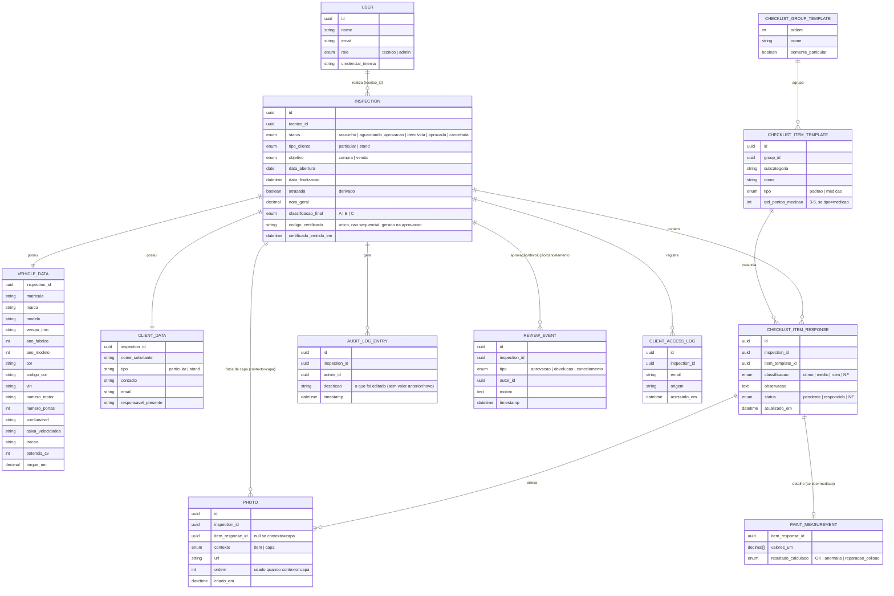

# Especificação Técnica — Sistema de Avaliação de Carros (MVP)

> Derivado do `PRD-Sistema-Avaliacao-Carros-v2.md`. Toda referência "PRD §X" aponta para a seção correspondente do PRD.
>
> **Atualizado em 2026-07-09** para refletir os cortes de escopo decididos em `docs/superpowers/specs/2026-07-09-inspecta-prd-design.md` (offline-first removido, upload síncrono, certificado como atributo da inspeção, auditoria simples, faixas de pintura fixas no código, sem múltiplos admins/versionamento de templates). Onde este documento e o PRD divergirem, o PRD é a fonte da verdade de escopo; este documento traz o detalhe técnico.

---

## 1. Requisitos Funcionais (RF)

### 1.1 Autenticação
- **RF-01** — O sistema deve permitir login para dois perfis: Técnico e Admin. (PRD §3, §4)

### 1.2 Dados básicos da inspeção
- **RF-02** — Ao criar uma inspeção, o sistema deve coletar todos os campos listados no PRD §5 (matrícula, marca, modelo, versão, anos, cor, VIN, motor, portas, combustível, caixa, tração, potência, torque, tipo de cliente, dados do solicitante, responsável presente, objetivo).
- **RF-03** — Se `tipo_cliente = stand`, o campo `objetivo` deve ser fixado em "venda" (não editável).
- **RF-04** — Se `tipo_cliente = particular`, o campo `objetivo` aceita "compra" ou "venda".
- **RF-05** — Para `tipo_cliente = stand`, os campos contacto/email podem ser preenchidos automaticamente se o stand já existir na base (autocomplete/lookup).
- **RF-06** — Os dados básicos devem ser salvos antes de liberar o acesso à checklist.

### 1.3 Checklist
- **RF-07** — A checklist deve ter os 12 grupos fixos definidos no PRD §6, na ordem especificada.
- **RF-08** — O grupo "Teste de Condução" (grupo 9) só deve ser exibido e exigido quando `tipo_cliente = particular`. Para stand, o grupo não aparece e não entra na regra de obrigatoriedade.
- **RF-09** — Dentro de cada grupo, os itens devem ser agrupados visualmente por subcategoria, sem afetar a regra de obrigatoriedade (que é sempre por item).
- **RF-10** — A tela principal deve listar os grupos na lateral, cada um mostrando a contagem de itens pendentes.
- **RF-11** — Cada grupo deve exibir indicador visual: ✅ (todos os itens respondidos) ou ⚠️ com contagem de pendentes.
- **RF-12** — O técnico deve poder navegar livremente entre grupos, a qualquer momento antes de finalizar.

### 1.4 Item padrão
- **RF-13** — Cada item padrão aceita uma classificação: ótimo, médio, ruim ou NF.
- **RF-14** — O sistema deve pedir confirmação explícita antes de aplicar a marcação NF.
- **RF-15** — O item deve aceitar 1+ fotos e texto livre de observação.
- **RF-16** — Quando a classificação for "ruim", pelo menos 1 foto é obrigatória antes de avançar/salvar o item.
- **RF-17** — Fotos e observações podem ser removidas pelo técnico enquanto a inspeção não estiver finalizada.
- **RF-18** — Itens marcados NF não entram no cálculo de pontuação nem aparecem no relatório.

### 1.5 Item de medição (espessura de pintura)
- **RF-19** — Os 13 itens de espessura de pintura do grupo Exterior devem suportar de 3 a 5 campos numéricos (µm), variável por peça.
- **RF-20** — O sistema deve calcular automaticamente o resultado (OK / Anomalia-Repintura provável / Indício de reparação de colisão) com base nas faixas do PRD §7.2, de forma parametrizável.
- **RF-21** — O item de medição também aceita foto e observação, como um item padrão.
- **RF-22** — O resultado do item de medição aparece no relatório dentro do grupo Exterior, mas fica fora do cálculo de pontuação numérica (PRD §7.2).

### 1.6 Regra de finalização
- **RF-23** — A inspeção só pode ser finalizada/enviada para aprovação quando todos os grupos aplicáveis ao tipo de cliente estiverem 100% respondidos (✅).
- **RF-24** — Se houver grupo pendente (⚠️), o botão de finalizar fica bloqueado/desabilitado, com mensagem indicando quantos itens faltam.

### 1.7 Autosave (online)
- **RF-25** — Toda alteração (nota, foto, observação, NF) deve ser salva diretamente no servidor assim que ocorre (v1.0 assume internet sempre disponível — sem storage local nem fila offline; ver PRD §7).
- **RF-26** — Se o salvamento de uma alteração falhar, o técnico deve ver um indicador de erro visível no próprio item e poder tentar novamente manualmente (retry).
- **RF-27** — Upload de foto ocorre de forma síncrona e direta no momento da captura, com indicador de carregamento na própria foto (sem fila de background nem barra de progresso separada).

~~RF-28 a RF-30 (fila de sincronização, ordem de envio, marcação "sincronização pendente" na lista do admin) removidos — eram exigências do modelo offline-first, fora do escopo do v1.0.~~

### 1.8 Fluxo de aprovação e devolução
- **RF-31** — O admin pode aprovar uma inspeção enviada pelo técnico, gerando o relatório.
- **RF-32** — O admin pode devolver a inspeção para revisão, com motivo obrigatório em texto livre.
- **RF-33** — Ao devolver, a inspeção volta ao estado "devolvida" e o motivo fica visível no topo da tela do técnico responsável.
- **RF-34** — O técnico corrige e reenvia; o ciclo aprovação/devolução pode se repetir sem limite de voltas.

### 1.9 Edição pelo admin e auditoria
- **RF-35** — O admin pode editar qualquer avaliação já criada (respondida ou finalizada).
- **RF-36** — Toda edição do admin em inspeção já registrada deve gerar entrada no log de auditoria com: autor, campo/item alterado, data/hora (sem valor anterior/novo — diff completo fora do escopo do v1.0).
- **RF-37** — O log de auditoria é uso interno e não aparece no relatório do cliente.

### 1.10 Pontuação
- **RF-38** — Cada classificação tem um valor numérico fixo no código (ótimo=10, médio=6, ruim=2; PRD §10.1) — sem tela de configuração no v1.0 (RNF-18).
- **RF-39** — Nota do grupo = média dos valores dos itens avaliados (não-NF) daquele grupo.
- **RF-40** — Se todos os itens de um grupo forem NF, o grupo não entra na nota geral nem aparece no relatório.
- **RF-41** — Nota geral do veículo = média das notas dos grupos com ao menos um item avaliado.
- **RF-42** — Classificação final (A/B/C) calculada a partir da nota geral, com cortes parametrizáveis (sugestão inicial PRD §10.3).

### 1.11 Relatório final
- **RF-43** — O relatório deve ter um carrossel de 10–15 fotos de alta qualidade, adicionadas pelo admin na aprovação.
- **RF-44** — O relatório deve exibir resumo do veículo e nota final (A/B/C).
- **RF-45** — O relatório deve oferecer filtros: Todos, Pontos de Atenção (itens "ruim"), Com Fotos.
- **RF-46** — O relatório exibe apenas grupos com ao menos um item avaliado (não-NF).
- **RF-47** — Dentro de cada grupo: nome do item, avaliação, foto (se existir), comentário (se existir).
- **RF-48** — Itens "ruim" recebem destaque visual automático (ex: vermelho), sem ação manual do admin.
- **RF-49** — O relatório deve ser legível tanto na tela quanto impresso, usando o mesmo relatório web responsivo com estilo de impressão do navegador (sem pipeline de PDF dedicado — só entra se virar necessidade real).
- **RF-50** — Dados sensíveis do solicitante (nome, contacto, email) não são exibidos no corpo do relatório (PRD §11.1). Dados técnicos do veículo aparecem normalmente.
- **RF-51** — O relatório exibe um código de certificado único (letras maiúsculas + números), gerado automaticamente na aprovação e armazenado como atributo da própria inspeção.
- ~~RF-52 (busca pública por código de certificado para verificar autenticidade) removido do v1.0 — o código já é gerado e exibido; a tela de consulta pública fica para fase futura.~~
- **RF-53** — O relatório exibe, no rodapé, nome (e credencial, se existir) do técnico responsável.

### 1.12 Acesso do cliente ao relatório
- **RF-54** — O link do relatório é gerado dentro da própria plataforma na aprovação; o admin copia e compartilha manualmente (WhatsApp/email) — sem disparo automático nem site público separado.
- **RF-55** — Antes de exibir o relatório, o link deve capturar email e origem/rastreio de acesso do cliente.
- **RF-56** — Após envio dessas informações, o relatório é liberado para visualização. Email e origem ficam armazenados separadamente do conteúdo do relatório, para fins de rastreio.

### 1.13 Administração — lista de inspeções
- **RF-57** — O admin deve visualizar todas as inspeções (não só as próprias), com: matrícula, marca/modelo, técnico, status, nota final (A/B/C), data de abertura e marcação "atrasada".
- **RF-58** — A lista deve suportar busca livre (matrícula, cliente, modelo) e filtros por período, técnico e tipo de cliente.
- **RF-59** — A lista deve suportar ordenação por data, nota ou status.
- **RF-60** — O admin pode cancelar/arquivar inspeções que nunca foram finalizadas (rascunho, aguardando aprovação, devolvida), com motivo obrigatório — ação registrada no log de auditoria.
- **RF-61** — Inspeção cancelada não pode ser reaberta nem editada.

### 1.14 Estado "atrasada"
- **RF-62** — O sistema deve marcar automaticamente como "atrasada" toda inspeção aberta em dia anterior e ainda não finalizada/cancelada.

---

## 2. Requisitos Não Funcionais (RNF)

### Disponibilidade
~~RNF-01 a RNF-03 (offline-first: storage local, fila de sincronização resiliente, tolerância a reinício do dispositivo) removidos — v1.0 assume internet sempre disponível no lançamento (1-2 técnicos, ver PRD §7). Reavaliar se/quando surgir necessidade real de operação offline.~~

### Performance
- **RNF-04** — Troca de grupo na checklist deve responder em <300ms percebidos (dado já local).
- **RNF-05** — Upload de foto deve dar feedback visual de carregamento na própria foto; não precisa ocorrer em segundo plano com fila/progresso (era exigência do modelo offline-first, removida).
- ~~RNF-06 (paginação/virtualização da lista do admin) removido — volume inicial baixo (1-2 técnicos) não justifica; reavaliar se o volume crescer.~~

### Segurança e privacidade
- **RNF-07** — Sistema sujeito ao RGPD (dados de cidadãos/matrículas portuguesas): dados pessoais do solicitante (nome, contacto, email) devem ter acesso restrito a Técnico/Admin e nunca aparecer no relatório público (PRD §11.1).
- **RNF-08** — Email e origem capturados do cliente no site (PRD §11.1) devem ser armazenados com controle de acesso e finalidade declarada (rastreio de marketing/atendimento).
- **RNF-09** — Toda comunicação cliente-servidor deve usar HTTPS/TLS.
- **RNF-10** — Fotos de avarias e dados de inspeção devem ser acessíveis apenas a usuários autenticados (Técnico/Admin); o relatório público expõe somente o subconjunto definido em RF-50.
- **RNF-11** — Log de auditoria deve ser imutável (somente inserção, sem edição/exclusão) e reter todo o histórico de alterações do admin.
- **RNF-12** — Senhas/credenciais devem seguir boas práticas (hash, sem armazenamento em texto plano).

### Auditabilidade e integridade do relatório
- **RNF-13** — O ID de certificado deve ser gerado de forma não sequencial/não adivinhável (evitar enumeração de relatórios de terceiros).
- **RNF-14** — A verificação de autenticidade por código deve confirmar apenas existência/validade do relatório, sem expor dados sensíveis na resposta.

### Usabilidade
- **RNF-15** — A interface do técnico deve ser otimizada para uso em tablet, com alvos de toque grandes (mínimo 44×44px) e uso confortável em campo (ex: garagem, luz variável).
- **RNF-16** — Fluxos críticos (marcar NF, marcar "ruim" sem foto) devem ter feedback visual imediato e mensagens de erro claras.
- **RNF-17** — O relatório web deve ser responsivo (mobile/desktop) e legível em impressão (PRD §11).

### Parametrização
- **RNF-18** — Valores de pontuação por classificação e cortes de A/B/C (PRD §10.1, §10.3) ficam fixos no código no v1.0 (ajustáveis por um dev quando necessário). Sem tela de configuração — só entra se virar necessidade real de negócio.
- **RNF-19** — Faixas de resultado dos itens de medição de espessura (PRD §7.2) seguem a mesma lógica: fixas no código, mesma decisão de RNF-18.

### Manutenibilidade / evolução
~~RNF-20 (estrutura preparada para versionamento futuro de templates) e RNF-21 (modelo de permissões preparado para múltiplos admins futuros) removidos — exigências de desenho especulativo para cenários que o negócio não tem hoje (checklist fixo por planilha, admin único). A separação natural entre `CHECKLIST_GROUP_TEMPLATE`/`CHECKLIST_ITEM_TEMPLATE` e as respostas é mantida por ser normalização razoável, não por exigência de "preparar pro futuro".~~

### Confiabilidade
- **RNF-22** — Nenhuma ação do técnico (foto, nota, observação) pode ser perdida silenciosamente — falha de salvamento deve ficar visível no item (RF-26) e re-tentável.
- **RNF-23** — Backup/retenção do banco de dados de produção (histórico de inspeções e relatórios é ativo do negócio de longo prazo).

---

## 3. Mapa de Permissões

| Ação | Técnico | Admin | Cliente (site) | Público (site, não autenticado) |
|---|---|---|---|---|
| Login no sistema interno | ✅ | ✅ | — | — |
| Criar nova inspeção | ✅ | ✅ | — | — |
| Preencher dados básicos | ✅ | ✅ | — | — |
| Preencher checklist / fotos / observações / NF | ✅ (própria) | ✅ | — | — |
| Editar inspeção já respondida/finalizada | ❌ | ✅ (com log de auditoria) | — | — |
| Enviar inspeção para aprovação | ✅ (própria) | ✅ | — | — |
| Aprovar / devolver inspeção | ❌ | ✅ | — | — |
| Adicionar fotos de capa do relatório | ❌ | ✅ | — | — |
| Cancelar/arquivar inspeção não finalizada | ❌ | ✅ | — | — |
| Ver apenas as próprias inspeções | ✅ | — | — | — |
| Ver todas as inspeções (lista geral) | ❌ | ✅ | — | — |
| Buscar/filtrar inspeções | ❌ | ✅ | — | — |
| Ver log de auditoria | ❌ | ✅ | — | — |
| Acessar relatório (após email+origem) | — | — | ✅ | — |
| Ver Hall da Fama / catálogo de stands (fase futura) | — | — | — | ✅ (futuro) |

~~Linha "Verificar autenticidade por código de certificado" removida — RF-52 (tela pública de consulta) fora do escopo do v1.0; o código já é gerado e exibido no relatório (RF-51).~~

Notas:
- MVP tem exatamente um Admin (PRD §3) — não há hierarquia entre admins nem conflito de edição concorrente a resolver agora. Sem desenho de suporte a múltiplos admins (RNF-20/21 removidos).
- Uma inspeção pertence a um único Técnico do início ao fim (PRD §3); o Técnico só enxerga/edita as suas próprias inspeções em aberto.
- "Cliente (site)" não é uma conta autenticada — é um visitante que passa pela barreira de email+origem (RF-55/56) para liberar a visualização de um relatório específico, cujo link é gerado dentro da plataforma e compartilhado manualmente pelo admin (RF-54).

---

## 4. Estrutura de Dados (modelo lógico)

Modelo conceitual, independente de tecnologia de banco (aplica-se tanto a um SQL relacional quanto a um documento-orientado com essas mesmas entidades).

Notas de modelagem:
- `CHECKLIST_GROUP_TEMPLATE` / `CHECKLIST_ITEM_TEMPLATE` ficam separados das respostas (`CHECKLIST_ITEM_RESPONSE`) por normalização natural (template vs. instância preenchida) — sem exigência de "preparar pra versionamento futuro" (RNF-20 removido).
- `VEHICLE_DATA` e `CLIENT_DATA` estão separados por serem tratados com regras de acesso diferentes: dados do veículo aparecem no relatório, dados do cliente não (RF-50).
- `PAINT_MEASUREMENT` é uma extensão 1:1 opcional de `CHECKLIST_ITEM_RESPONSE`, só existe quando o item é do tipo `medicao`.
- `PHOTO` é uma única tabela para fotos de item e fotos de capa do relatório, diferenciadas pelo campo `contexto` — antes eram duas tabelas quase idênticas (`PHOTO` + `REPORT_COVER_PHOTO`).
- `codigo_certificado` e `certificado_emitido_em` vivem direto em `INSPECTION` (antes era uma tabela `CERTIFICATE` separada) — é uma relação 1:1 que só existe após aprovação, não precisa de tabela e join próprios.
- `AUDIT_LOG_ENTRY` é somente-inserção (RNF-11) e simples (quem/o quê/quando, sem diff de valor anterior/novo); nenhuma operação de update/delete deve existir sobre essa tabela na camada de aplicação.
- `atrasada` em `INSPECTION` é campo derivado/calculado, pode ser calculado em tempo de leitura a partir de `data_abertura` + `status`, sem persistir.

---

## 5. Roadmap de Desenvolvimento (MVP)

Sequenciado a partir das prioridades do PRD §15, em fases entregáveis e testáveis de forma incremental.

| Fase | Escopo | RFs principais |
|---|---|---|
| **0. Fundação** | Definição de stack, setup de projeto, modelo de dados, autenticação básica (Técnico/Admin) | RF-01 |
| **1. Inspeção — núcleo** | Dados básicos do veículo/cliente, estrutura dos 12 grupos e itens (templates), tela de checklist com navegação por grupo, indicadores ✅/⚠️ | RF-02 a RF-12, RF-23–24 |
| **2. Preenchimento de item** | Classificação padrão, NF com confirmação, fotos (regra "ruim" exige foto), observações, item de medição de espessura com cálculo automático | RF-13 a RF-22 |
| **3. Autosave online** | Salvamento direto no servidor a cada alteração, indicador de erro/retry, upload de foto direto | RF-25 a RF-27, RNF-22 |
| **4. Pontuação** | Cálculo de nota por grupo/geral, classificação A/B/C (valores fixos no código) | RF-38 a RF-42, RNF-18–19 |
| **5. Admin — revisão** | Lista geral de inspeções (busca/filtro/ordenação), aprovação, devolução com motivo, edição pelo admin, log de auditoria simples, cancelamento/arquivamento | RF-31 a RF-37, RF-57 a RF-62 |
| **6. Relatório final** | Geração do relatório (grupos, filtros, destaque de "ruim"), fotos de capa, relatório único responsivo com impressão via CSS, código de certificado, assinatura do técnico | RF-43 a RF-53, RNF-13 |
| **7. Acesso do cliente ao relatório** | Captura de email+origem, liberação do relatório dentro da plataforma, compartilhamento manual do link pelo admin | RF-54 a RF-56 |
| **8. Hardening & QA** | Revisão de segurança/RGPD, testes de fluxo completo, performance da lista admin, acessibilidade do relatório | Todos os RNF |

Fora do MVP (não entra no roadmap acima): portal público/Hall da Fama, catálogo de stands, templates versionáveis de checklist, múltiplos admins, relatórios analíticos, offline-first, tela de configuração de pontuação/faixas, tela de admin para editar o checklist, busca pública por código de certificado, exportação de PDF dedicada — ver `docs/superpowers/specs/2026-07-09-inspecta-prd-design.md` §4.

---

## 6. Pontos em aberto (herdados do PRD §17)

Precisam de validação antes ou durante a Fase 4/6:
- Valores exatos de pontuação por classificação e cortes A/B/C.
- Lista exata de campos "sensíveis" ocultos no relatório.
- Formato exato do campo "origem/rastreio" no acesso ao relatório (select fixo vs texto livre vs UTM).
- Se o resultado dos itens de medição de espessura deve futuramente entrar no cálculo de pontuação.

Adicional, específico desta etapa:
- Stack técnica (frontend/backend/DB) ainda não definida — não é bloqueante para este documento, mas é pré-requisito da Fase 0. Mecanismo offline não é mais um critério de escolha (v1.0 assume internet sempre disponível).
- Design do relatório final já existe (fornecido pelo usuário) — falta design do dashboard/checklist do técnico e admin.
- Conteúdo exato dos 300+ itens do checklist (planilha/JSON) precisa estar pronto antes da Fase 1.
- Comportamento exato de "aplicar aos demais" em itens repetidos (copia só classificação, ou também foto/observação?) — a definir na Fase 1/2.

Ver também `docs/superpowers/specs/2026-07-09-inspecta-prd-design.md` — PRD de produto com problema, jornada do usuário e escopo v1.0, fonte da verdade para decisões de corte de escopo.
